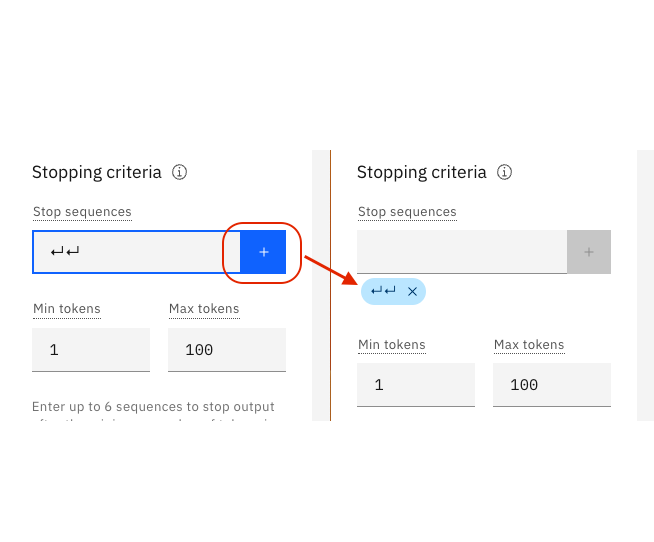

# Prompt engineering

**Note:** The following images show actual results from watsonx.ai. The slight gray text is what we provided to the model.  The blue highlighted text is how the model responded.

### 1.0 LLM Foundations
Before we jump into exploring the capabilities of watsonx.ai, we first need to lay a foundation for how Large Language Models (LLMs) work, and how we can tune the model and parameters to change their output. Gaining this understanding will make us more effective prompt engineers.


When you open up watsonx.ai, this is the view you will be shown.  The large central text area is called Prompt Lab, or Prompt Builder if you select the more advanced view by clicking the checkbox at top-left.  On the right-side are model parameters that you can use to select to optimize how the model responds to your prompt.  And on the bottom-left, is a summary of the number of tokens used by your prompt during execution.

### 1.1 Tokens

Each time you enter a prompt, your “input tokens” and “generated tokens” will update. Tokens are an important concept to understand as they constrain the performance of your model plus determine the cost of using models.  As you will learn throughout the Labs, tokens are not a 1:1 match with words in natural language, but on average, one token is equal to 4 characters.  Before sending your prompt to the model, the prompt's text is Tokenized or broken into smaller subsets of characters better understood by a model.

It is important to monitor your token usage to know how much information you are feeding into the model with each prompt, as well as how much text is generated for you. Depending on the model selected in Prompt Builder, you will see a max of 2048 or 4096 tokens.  Keep in mind that the more expressive you are with your prompt instructions, the less room the model has to respond back to you.

### 1.2 Everything is text completion

watsonx.ai is not a chatbot interface so just specifying an instruction or question rarely produces a good result. For instance, what if we ask Watsonx.ai to:
```List ideas to start a dog-walking business?```

We can see that depending on the model we use, we will see entirely different outputs!
1) flan-ul2-20b:


2) granite-13b-chat-v2:


<p> </p>

### 1.3 Cue the output structure

We can see from the above example that simple prompts do not work with smaller LLMs like flan-ul2-20b or granite-13b-chat-v2.  To receive a structured response, include a cue to start the response in the desired structure.  For example, just adding the character "-" with our granite model improves the formatting of our response and groups together our output list.

Again using granite-13b-chat-v2:


<p> </p>

### 1.4 Provide an example as guidance (or Single Shot Prompting)

For models such as flan-ul2-20b, simply cueing the output structure may not be enough. To receive a higher-quality response, provide an example of the kind of response you want.  In technical terms, this is called Single Shot Prompting. 

Here is the result now using flan-ul2-20b, an improvement from before!


As you can see, providing one example before generating with your LLM did improve our result, but adding more examples into your prompt is common practice as well and can help a lot with small models like flan-ul2-20b. Generally, increasing the number of examples is referred to as “Few Shot Prompting” and is a powerful tool to ensure you have a specific output.

Copy paste to get started experimenting:

```
List ideas to start a lemonade business:
1. Setup a lemonade stand
2. Partner with a restaurant
3. Arrange for a celebrity to endorse the lemonade

List ideas to start a dog-walking business:
1. 
```

### 1.5 Include descriptive details

The more guidance, the better. The following examples use granite-13b-chat-v2 (and could be improved using few shot prompting):

- Content: here we give some additional instructions at the top level of our prompt. This can help make adjustments to the model or help prioritize specific content, such as creative business ideas.


- Style: here we focus on the messaging of the LLM. The following example is to create happy, upbeat messaging for a dog-walking advertisement.

  
- Length: in this example We do a mix of playing around with min/max tokens as well as specifically attempting to tell the model how long we want to output to be. Working with length helps you prevent the output from being cut-off as seen in some other examples where we have not made adjustments for that.


# Model Parameters


### 2.0 Adjusting the model's behaviour
The first change we can make is what model (LLM) we use to evaluate our prompt. This is one of the biggest changes you can make, as certain models are better built for specific tasks. The exercises later on this lab will force you to change the model you use if you want to answer some of the more challenging questions.

In general, some models perform better working with summarization, key words, and semantics, while other models do better with structured text such as HTML, markdown, or JSON. The best way to figure out which models apply for your use case is to simply test them, but it is important to know that choice of model can make a big difference!

watsonx.ai also provides multiple parameters for configuring how LLMs respond to a prompt.  Selecting the correct parameters can often be more art than science.  Investing time into understanding then tweaking these parameters will be rewarded by better responses.

Explore these parameters with the following text:
```
List ideas to start a lemonade business:
1. Setup a lemonade stand
2. Partner with a restaurant
3. Arrange for a celebrity to endorse the lemonade

List ideas to start a dog-walking business:
1. 
```

### 2.1 Set the min and max tokens

If you're finding the generated text is too short or too long, try adjusting the parameters that control the number of new tokens:

- The **Min new tokens** parameter controls the minimum number of tokens (~words) in the generated response
- The **Max new tokens** parameter controls the maximum number of tokens (~words) in the generated response


### 2.2 Specify stop sequences

If you specify stop sequences, the output will automatically stop when one of the stop sequences appears in the generated output.

**Example**

The output in the following image goes too far, there are two answers:


In the following image, the stop sequence of two carriage returns is specified:



The following image shows the effect of the stop sequence.  The output stops after two carriage returns:


<p> </p>

### 2.3 Adjust decoding parameters

If the response is too generic or going on wild tangents, consider adjusting the decoding parameters.  Or conversely, the response may not be creative enough.

**Decoding** is the process of finding the output sequence given the input sequence:

- **Greedy decoding** selects the word with the highest probability at each step of the decoding process. 
- **Sampling decoding** selects words from a probability distribution at each step:
  - **Temperature** refers to selecting high- or low-probability words.  Higher temperature values lead to more variability.
  - **Top-p** (nucleus sampling) refers to selecting the smallest set of words whose cumulative probability exceeds p.
  - **Top-k** refers to selecting k words with the highest probabilities at each step.  Higher values lead to more variability.

An advantage of greedy decoding is that you will see reproducible results. This can be useful for testing.
Setting temperature to 0 in a sampling decoding approach gives the same variance as greedy decoding.


See:

- [Most-used decoder methods](https://medium.com/nlplanet/two-minutes-nlp-most-used-decoding-methods-for-language-models-9d44b2375612)
- [Using different decoding methods](https://huggingface.co/blog/how-to-generate)

<p> </p>

### 2.4 Add a repetition penalty

Sometimes, you'll see text being repeated over and over:


Increasing the temperature can sometimes resolve the problem.

However, when text is still repetative even with a higher temperature, you can try adding a repetition penality.  The higher the penalty, the less likely the results will include repeated text. Usually a large change is not needed (this depends on factors such as the model being used), so try out small 0.1 increases of temperature at a time.


### 2.5 Excellent 3rd party blog post on model parameters
The descriptions above provide a good introduction to model parameters.  However you should [read this 3rd party post on model parameters](https://txt.cohere.com/llm-parameters-best-outputs-language-ai) which provides excellent additional examples of how model parameters work plus good visuals to help you better understand the concepts.  The better you understand model parameters, the less frustrated you will be and more empowered to tweak the models to perform as needed for your use case.

# General advice

### 3.1 Try different models

The watsonx.ai documentation describes the available models: [watsonx.ai models](https://dataplatform.cloud.ibm.com/docs/content/wsj/analyze-data/fm-models.html?context=wx&audience=wdp)


### 3.2 Check your use case

LLMs have great potential, but they have no logic, no knowledge, and no domain expertise.  Some use cases are a better fit than others: LLMs excel at tasks that involve generating generic text or common code patterns and transforming given input.

If your prompt includes all the tips and best practices discussed here, yet you're not getting good results from any of the models, consider whether your use case might be one that LLMs just cannot handle well.

For example, although we can get decent results for simple arithmetic, LLMs cannot generally do math well: [Researchers find that large language models struggle with math](https://venturebeat.com/business/researchers-find-that-large-language-models-struggle-with-math/)

### 4.0 Balancing intelligence and security
With great artificial intelligence comes higher security risks. Solutions like ChatGPT are Very Large language Models (VLLMs) with 175 billion parameters. They fine-tuned by the OpenAI team using an additional non-public Chat datasets plus a Reinforcement Learning Human Feedback (RLHF) dataset. ChatGPT is a chatbot-enabled LLM. 

In watsonx.ai, we are interacting directly with smaller LLMs (3-20 billion parameters).  This is a wise choice from a security POV. Prompt injection is a major risk for enterprise uses of LLMs. In prompt injections, a hacker will create an intricate prompt in order to cause a LLM such as ChatGPT to ignore/bypass security protocols and reveal sensitive company information. Just imagine you're a hacker.  Which model would you choose to target for prompt injection hacking? OpenAI's ChatGPT with 175 billion parameters capable of thousands of tasks or a smaller, more-focused 3 billion parameter model highly tuned for a few isolated tasks?  Which has a larger attack surface for prompt re-engineering?

The smaller, simpler models in watsonx.ai are more challenging for potential hackers. Using many small models rather than a single large one such as ChatGPT creates a wider distribution of sensitive entry points. Each small language model is much harder to manipulate due their limited functionality and high level of prompt engineering that was required to perform their primary tasks. They don’t have the wide range of functions such as ChatGPT.  As programmers know, putting all your resources into a single point of failure is unwise.  It's far better to decompose your solution for security, scalability and control.

That's right.  For security, smaller is better. On top of security benefits, there are computational improvements with using smaller, lighter weight models as well. However we're getting ahead of ourselves.  Let's first interact more with watsonx.ai's LLMs to better understand and learn how to make them respond the way we need.

# Further learning

- [OpenAI prompt intro](https://platform.openai.com/docs/guides/completion/prompt-design)
- [OpenAI prompt engineering tutorial](https://help.openai.com/en/articles/6654000-best-practices-for-prompt-engineering-with-openai-api)
- [co:here prompt engineering tutorial](https://docs.cohere.ai/docs/prompt-engineering)
